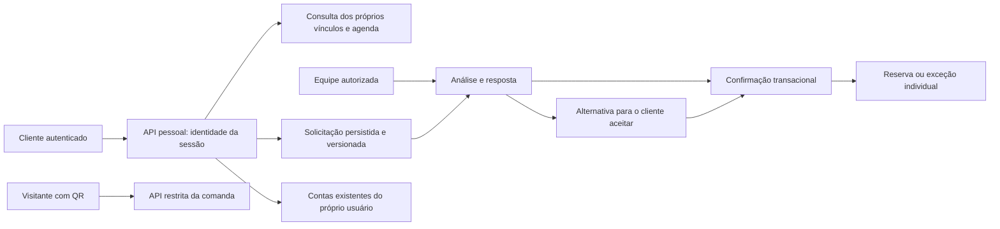

# ADR-007 — Área pessoal do cliente e solicitações acompanhadas

Data: 2026-10-06. Estado: implementado para revisão; validação visual e aceite com clientes pendentes.

## Decisão

A área pessoal usa a autenticação individual do Long Beach e navegação própria: Início, Minha agenda, Bar, Pagamentos e Perfil. `/minha-area` não usa a estrutura administrativa. `/minhas-contas` redireciona para os pagamentos pessoais. O acesso por QR continua independente e limitado à comanda.

Reutilizamos matrículas, alunos, turmas, reservas, grupos, contas e pagamentos existentes. Novos registros tipados de perfil, vínculos, solicitações, identidade da operação, exceções individuais e avaliações usam `operational_records`, sem migration adicional nesta entrega. Esses tipos não integram a lista permitida dos endpoints genéricos de operações. O interceptor de auditoria existente registra ator, recurso, operação e momento, omitindo o conteúdo com dados pessoais.

O servidor obtém o usuário da sessão; nunca aceita um usuário escolhido pelo cliente para consultar agenda, contas, perfil ou solicitações. Os vínculos vêm de identificadores explícitos cadastrados pela gestão ou da associação existente entre conta financeira, aluno e responsável. Nomes, telefone e e-mail digitados não concedem acesso. Um cadastro já vinculado a outro cliente/responsável exige correção administrativa, sem reassociação silenciosa. O apelido e o telefone pessoais não substituem a identidade de acesso.

## Solicitações e consistência

Fluxo: enviada → em análise → confirmada, não disponível ou alternativa. Uma alternativa só vira confirmação após aceite do próprio cliente e nova verificação de disponibilidade. O histórico de respostas é mantido na solicitação; nenhuma solicitação cancela ou remarca um compromisso antes da confirmação.

As alterações usam transação e o mesmo bloqueio consultivo do PostgreSQL que protege a agenda administrativa. O identificador da operação e sua impressão digital preservam a intenção original, impedindo duplicação ou reuso com dados diferentes. A versão da solicitação impede respostas sobre versões antigas. A confirmação verifica novamente horário, quadra, professor e o compromisso original. Aceites concorrentes produzem uma única reserva.

Aula experimental é uma reserva individual, com professor, fora dos horários ocupados pela grade. Remarcação de aula produz uma reserva individual e uma exceção apenas para aquela ocorrência do aluno. Cancelamento de aula cria uma exceção individual: não cancela turma, matrícula ou aula de outros alunos. Essas exceções aparecem na agenda pessoal e no atendimento das solicitações; a lista administrativa de presenças não é reescrita automaticamente.

Remarcação de reserva mantém seu identificador e valor; para mensalistas, também permanece no mesmo mês. O valor deve ser confirmado explicitamente pela equipe, inclusive zero para atividade gratuita. Alterações financeiras seguem os fluxos existentes. Confirmar ou cancelar uma solicitação não cria cobrança, estorno ou assinatura, nem suspende atividades por inadimplência. O grupo continua com cobrança integral ao responsável e cada conta é paga separadamente.

## Consulta e privacidade

A agenda apresenta os últimos 30 e os próximos 60 dias. Solicitações podem indicar até 12 meses; confirme esta diferença de horizonte com a operação antes de ampliar a agenda. Avaliações são de 1 a 5, uma por atividade própria já encerrada, com reenvio idempotente. Lembretes desta versão são avisos dentro da área pessoal, conforme preferência; não há envio externo.

Encerrar a comanda preserva somente a consulta pelo acesso já emitido até a validade original (24 horas após emissão), permitindo salvar/imprimir o histórico. Catálogo, pedidos e pagamentos permanecem bloqueados. Revogação explícita e expiração continuam negando consulta. O QR não revela a agenda, os dados pessoais nem contas de outras visitas. O histórico de contas vinculadas continua acessível pela autenticação individual.

## Diagrama de responsabilidade

## Limites e reversão

Depende do ADR-006 e das migrations de pagamentos. A área pessoal não ativa o provedor de pagamentos. Consultas ainda usam os registros operacionais existentes em memória; avaliar índices/consultas dedicadas e paginação antes de grande crescimento, sem alterar a regra de autorização.

A reversão promove os artefatos anteriores de API e frontend, preservando os novos registros no banco para retomada. Não remover dados nem executar downgrade de pagamentos. A versão anterior volta a negar leitura de comanda encerrada, sem reabrir pedidos. Produção segue aprovação do environment e promoção identificada por commit.
