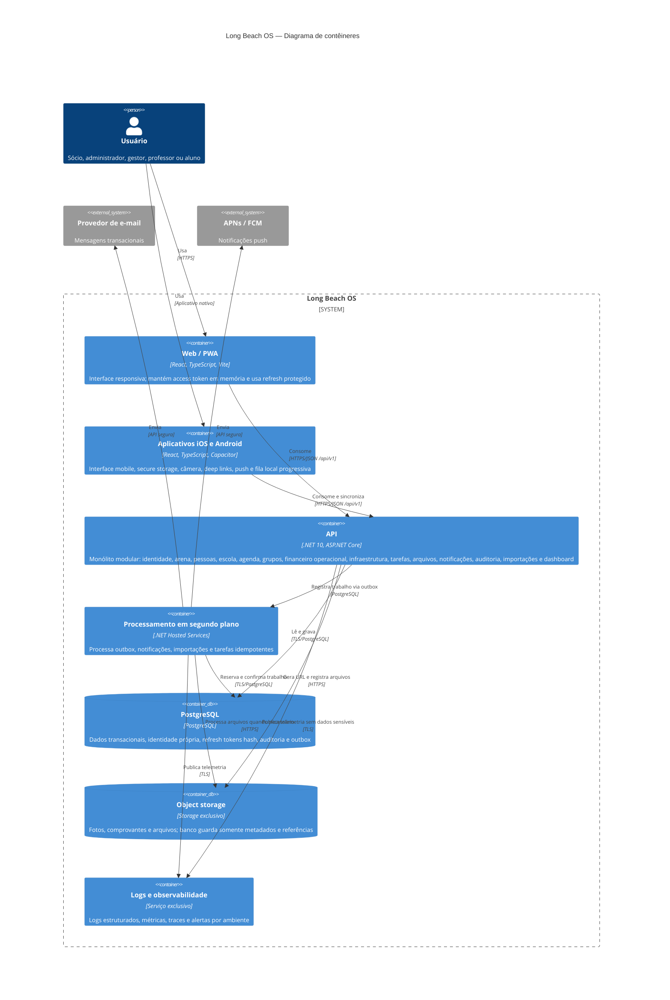

# C4 — Contêineres do Long Beach OS

## Regras entre contêineres

- Web e mobile nunca acessam PostgreSQL, storage ou providers diretamente com credenciais privilegiadas.
- A API é a autoridade de autenticação, autorização e regras de negócio.
- Arquivos são enviados com URLs curtas e escopo restrito; a confirmação passa pela API.
- O worker pode iniciar dentro do processo da API na primeira fase, mas seu contrato lógico e suas tarefas são idempotentes.
- Falhas em e-mail ou push permanecem na outbox para nova tentativa e não revertem uma transação já confirmada.
- Logs, banco, storage e secrets são exclusivos por ambiente.

## Implantação de Production

- `longbeach-web` publica a Web/PWA no Railway e, depois do corte validado, atende `https://longbeach.quebranunca.com.br`.
- `longbeach-api` publica a API no Railway e atende `https://api.longbeach.quebranunca.com.br`.
- o PostgreSQL é um recurso exclusivo do projeto standalone e só aceita conexões dos serviços autorizados desse projeto;
- worker, object storage e observabilidade permanecem limites lógicos próprios, mesmo quando a primeira release executa o worker no processo da API ou usa serviços gerenciados do provedor;
- nenhum contêiner referencia serviço, banco, volume, secret ou domínio interno da Plataforma QuebraNunca ou do projeto Railway legado;
- antes do corte, o legado atende `longbeach.quebranunca.com.br`; depois, permanece fora desta fronteira e acessível por seu domínio técnico Railway durante a janela de retorno;
- compartilhar o namespace DNS e a conta Railway é uma conveniência administrativa e não cria dependência de código, dados, autenticação, API ou deploy.
