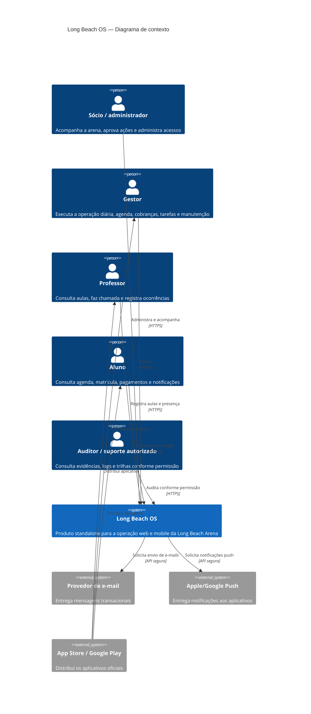

# C4 — Contexto do Long Beach OS

## Escopo

O Long Beach OS é o sistema próprio da arena para escola, agenda, grupos, operação financeira, infraestrutura, tarefas, arquivos, notificações, importações e indicadores. A Plataforma QuebraNunca não está dentro do limite do sistema e não é necessária para nenhum fluxo.

## Fronteira com a QuebraNunca

O Long Beach OS de Production é publicado em `longbeach.quebranunca.com.br` e `api.longbeach.quebranunca.com.br`. O namespace DNS e a conta administrativa do Railway podem ser compartilhados com outros produtos, mas projeto, serviços, banco, secrets, logs, migrations, autenticação e deploy são exclusivos do Long Beach OS, conforme o ADR-003.

Durante a transição, o dashboard legado permanece em serviço separado. Antes do corte, ele continua atendendo o endereço web oficial enquanto a base standalone é validada pelos domínios técnicos do Railway. Depois do corte, o legado continua acessível por seu endereço técnico durante a janela de retorno, sem conexão de runtime com a nova aplicação.

Uma integração futura com a Plataforma QuebraNunca poderá ser adicionada como sistema externo por OAuth 2.0/OpenID Connect ou API versionada, com consentimento e disponibilidade opcional. Ela não pode virar requisito para login, leitura ou escrita dos dados da Long Beach.

## Fluxos prioritários

- Sócios e gestores administram usuários, arena e operação.
- Professores consultam suas aulas e registram chamada.
- Alunos consultam agenda, situação da matrícula e pagamentos.
- Alterações críticas geram evento de auditoria no próprio Long Beach OS.
- Notificações saem por adapters; a indisponibilidade do canal não invalida a transação de negócio.
