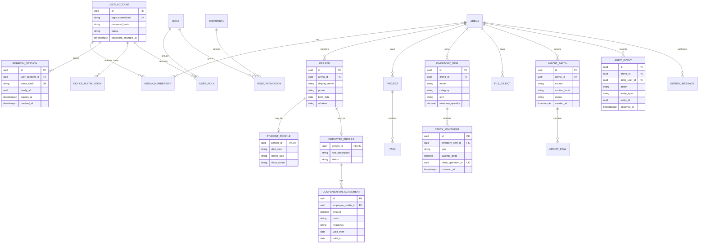

# Modelo de dados da primeira release

> Referência da fundação, preservada como histórico de intenção. O inventário implementado e a implantação vigente estão em [Estado atual](../operacao/estado-atual.md). Agenda, mensalistas e cobranças já possuem implementação; não interpretar o roadmap abaixo como lista atual de funcionalidades ausentes.

## Escopo

A primeira release técnica reúne a fundação standalone e a menor fatia operacional necessária para migrar com segurança os dados que já recebem escrita. Ela não implementa ainda toda a Escola, Agenda, Financeiro ou Infraestrutura previstas no roadmap.

Inclui:

- arena e configurações;
- identidade, papéis, permissões, sessões e dispositivos;
- pessoas, complemento de aluno e vínculo de funcionário;
- regra de remuneração com vigência;
- projetos/tarefas simples;
- itens e movimentações de estoque;
- arquivos, importações, auditoria e outbox;
- metadados de origem para migração.

Mensalidades, pagamentos, turmas, presença, locações e conciliação financeira entram por migrations posteriores depois que seus conceitos forem validados na Fase 1/2. Os registros históricos correspondentes podem permanecer em staging até essa validação.

## Regras transversais

- Tabelas usam `uuid` com UUID v7 e nomes físicos em `snake_case`.
- Entidades operacionais têm `arena_id`, `created_at`, `created_by`, `updated_at`, `updated_by` e `version` quando aplicável.
- Instantes são `timestamptz` UTC; `birth_date`, `due_date` e datas civis são `date`; competência é representada pelo primeiro dia do mês ou value object validado.
- Valores monetários são `numeric(19,4)` + moeda `char(3)` quando houver possibilidade futura de outra moeda; BRL é o padrão.
- E-mail normalizado possui índice único apropriado; o valor de exibição é preservado separadamente quando necessário.
- `external_reference`, `integration_source` e `last_synchronized_at` são opcionais e nunca necessários para o domínio funcionar.
- Razão de estoque, auditoria e lotes confirmados são imutáveis; correção ocorre por evento compensatório.
- Dados pessoais não são duplicados em JSON de auditoria/importação depois da conciliação além do necessário para rastreabilidade e retenção.

## Diagrama lógico

## Catálogo de entidades

### Foundation e identidade

| Entidade | Finalidade | Restrições essenciais |
|---|---|---|
| `Arena` | unidade operacional e timezone | slug único; timezone IANA válido; uma arena inicial |
| `ArenaMembership` | vínculo de usuário com arena | único por usuário/arena; status e vigência |
| `UserAccount` | credencial e estado do login | login normalizado único; hash forte; sem senha reversível |
| `Role`, `Permission`, `UserRole`, `RolePermission` | RBAC e policies | códigos estáveis; mudanças administrativas auditadas |
| `RefreshSession` | rotação/revogação por dispositivo | token somente hash; família, uso anterior e motivo de revogação |
| `DeviceInstallation` | instalação mobile e push | identificador aleatório; push token cifrado/protegido; plataforma |

### Pessoas

| Entidade | Finalidade | Restrições essenciais |
|---|---|---|
| `Person` | dados de contato comuns | nome obrigatório; PII com acesso restrito; possível referência legada |
| `StudentProfile` | campos específicos do aluno | tamanhos como códigos validados; `class_status` explícito, não booleano ambíguo |
| `EmployeeProfile` | vínculo de trabalho/operação | função e status; pode coexistir com perfil de aluno |
| `CompensationAgreement` | regra de pagamento histórica | período sem sobreposição para mesma modalidade; valor não negativo; campos “a confirmar” modelados como pendência, não valor inventado |

### Planejamento e estoque

| Entidade | Finalidade | Restrições essenciais |
|---|---|---|
| `Project` | agrupador de entrega | título, status, responsável opcional e prazo |
| `Task` | item executável | status, prioridade, responsável, prazo e vínculo opcional ao projeto |
| `InventoryItem` | item controlado | nome por arena, categoria, unidade e mínimo; unidade não muda após movimento |
| `StockMovement` | razão imutável do estoque | delta assinado não zero; contagem gera ajuste; idempotência por operação cliente |

O saldo é a soma das movimentações, podendo haver projeção/cache reconstruível. Uma “contagem” não substitui ou edita movimentos anteriores: calcula e grava um ajuste com motivo e auditoria.

### Plataforma e migração

| Entidade | Finalidade | Restrições essenciais |
|---|---|---|
| `FileObject` | metadados de arquivo no object storage | storage key opaca, hash, tamanho, MIME validado, status de varredura |
| `ImportBatch` | uma importação identificável | origem + hash únicos conforme política; status e totais |
| `ImportRow` | linha bruta/normalizada e decisão | número de linha, status, erros e entidade criada; payload protegido e com retenção |
| `AuditEvent` | trilha append-only de ação de negócio | ator, ação, alvo, instante, correlation ID e mudanças mascaradas |
| `OutboxMessage` | entrega confiável de evento | tipo, payload mínimo, tentativas, próxima tentativa e confirmação |

## Estados baseline

- Usuário: `Invited`, `Active`, `Locked`, `Disabled`.
- Funcionário: `PendingConfirmation`, `Active`, `Inactive`.
- Situação de aula do aluno: `Unknown`, `Active`, `Paused`, `Inactive`.
- Projeto/tarefa: `Todo`, `InProgress`, `Done`, `Paused`, `Cancelled`.
- Importação: `Uploaded`, `Validating`, `NeedsReview`, `Approved`, `Applying`, `Completed`, `Failed`.
- Item: `Active`, `Inactive`; movimentos: `OpeningBalance`, `Inbound`, `Outbound`, `CountAdjustment`, `Correction`.

Os códigos são persistidos em inglês e apresentados em português. Remoção/renome de código exige migration compatível.

## Índices iniciais

- `user_account(login_normalized)` único.
- `arena_membership(arena_id, user_account_id)` único.
- `refresh_session(token_hash)` único e `(user_account_id, revoked_at, expires_at)`.
- `person(arena_id, display_name)`; busca textual pode evoluir depois de medir volume.
- `compensation_agreement(employee_profile_id, valid_from, valid_to)`.
- `project(arena_id, status, due_date)` e `task(arena_id, status, due_date)`.
- `inventory_item(arena_id, status, category, name)`.
- `stock_movement(inventory_item_id, occurred_at, id)` e operação cliente única por arena.
- `audit_event(arena_id, occurred_at, id)`, `(entity_type, entity_id, occurred_at)` e `(actor_user_id, occurred_at)`.
- `import_batch(arena_id, source, content_hash)` conforme política de reprocessamento.
- `outbox_message(processed_at, next_attempt_at)` parcial para pendentes.

## Retenção e privacidade

- Definir política formal antes de Production; este modelo não presume retenção infinita.
- Refresh expirado/revogado, IP e user agent têm janela de segurança definida.
- AuditEvent evita valor secreto e mascara PII; eventos financeiros e de acesso seguem retenção aplicável.
- Payload bruto de ImportRow é removido ou reduzido após conciliação e janela de contestação; manifesto/hash permanece.
- Arquivos usam lifecycle no storage e deleção coordenada com o registro, quando permitido.

## Evolução planejada

As próximas migrations acrescentam School (turmas, matrículas, aulas, presença, mensalidades e pagamentos), Schedule/Groups, OperationalFinance e InfrastructureAssets. Essas extensões devem referenciar `Arena` e `Person` sem alterar a independência do núcleo nem converter referências externas opcionais em requisitos.
